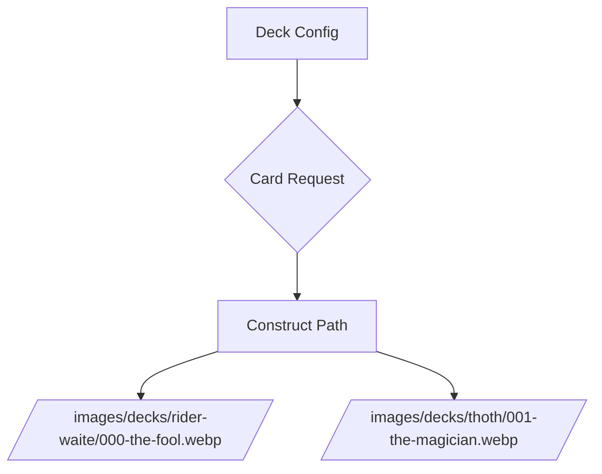

# Project Documentation

## Active Requirements

- ✅ Rider-Waite deck integration
- ✅ Multi-deck support architecture
- ✅ Spread type configuration per deck
- ✅ Image path standardization
- ◻️ Deck switching UI component
- ◻️ Deck validation system

## Implementation Details

### Deck Configuration

- Location: `client/src/config/tarot-deck-config.ts`
- Manages:
  - Active deck selection
  - Deck-specific image paths
  - Supported spread types
  - Card back images

### Spread Types

| Spread        | Description                          | Supported Decks |
|---------------|--------------------------------------|-----------------|
| Daily         | Single card daily reading           | All decks       |
| 3-card        | Past/Present/Future                 | Rider-Waite     |
| Love          | Relationship insight                | Rider-Waite     |
| Career        | Professional guidance               | Rider-Waite     |
| Zodiac        | Astrologically-aligned reading      | Rider-Waite     |

### Image Management

## Next Steps

1. Create deck selector UI component
2. Implement spread configuration validation
3. Add Thoth deck configuration
4. Develop deck preview functionality

Last Updated: 4/18/2025 12:16 AM EST
